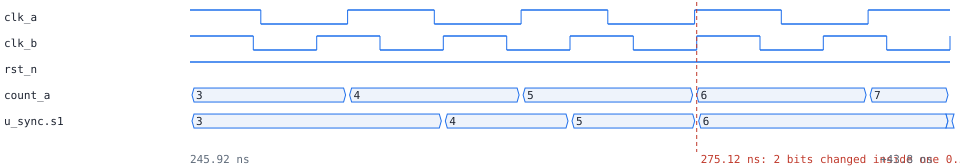

# clockguard: cdc_bus

1 error(s), 0 warning(s), 0 waived. 16 flop bits, 2 domain(s), 1 synchronizer(s).

## Clock domains

| domain | kind | group | flop bits | posedge / negedge | gated by |
|---|---|---|---|---|---|
| clk_a | primary | 0 | 6 | 6 / 0 | - |
| clk_b | primary | 1 | 10 | 10 / 0 | - |

## Resets

| reset | kind | stages | synchronous to | from | consumers |
|---|---|---|---|---|---|
| rst_n | input | - | - | rst_n | clk_a: 2, clk_b: 2 |
| rst_a_n | synchronizer | 2 | clk_a | rst_n | clk_a: 4 |
| rst_b_n | synchronizer | 2 | clk_b | rst_n | clk_b: 8 |

## Synchronizers

| from | to | bits | stages | kind |
|---|---|---|---|---|
| count_a (clk_a) | u_sync.s1 (clk_b) | 4 | 2 | bus |

## Crossings

| from | to | bits | status |
|---|---|---|---|
| count_a (clk_a) | u_sync.s1 (clk_b) | 4 | synchronized |

## Violations

### error: CDC_BUS

`count_a (clk_a) -> u_sync.s1 (clk_b)`

count_a (4 bits, clk_a) is synchronized bit by bit into u_sync.s1 (clk_b); bits that change together can land in different cycles and give a value that never existed. Gray-code it so one bit changes at a time, or use a handshake or an async FIFO

Path: `count_a[0] -> u_sync.s1[0]`

Debug scope: 2 net(s) on the reported path, out of 11 in the destination's fan-in cone.

Simulation: observed 69 hazard(s); first at 275.12 ns (2 bits changed inside one 0.5 ns capture window), 32 clk_b cycles after reset release

