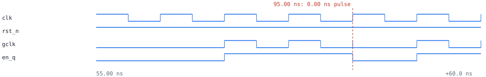

# clockguard: clk_gate_glitch

1 error(s), 0 warning(s), 0 waived. 11 flop bits, 1 domain(s), 0 synchronizer(s).

## Clock domains

| domain | kind | group | flop bits | posedge / negedge | gated by |
|---|---|---|---|---|---|
| clk | primary | 0 | 11 | 11 / 0 | gclk |

## Resets

| reset | kind | stages | synchronous to | from | consumers |
|---|---|---|---|---|---|
| rst_n | input | - | - | rst_n | clk: 2 |
| rst_s_n | synchronizer | 2 | clk | rst_n | clk: 9 |

## Synchronizers

none

## Crossings

none

## Violations

### error: CLK_GATE_GLITCH

`en_q (clk) -> gclk (clk)`

clock gate gclk: enable en_q comes from a posedge flop, so it changes while clk is high and can chop a clock pulse. Use a latch-based clock gate (latch transparent while clk is low)

Path: `en_q -> gclk`

Simulation: observed 503 hazard(s); first at 95.00 ns (0.00 ns pulse), 5 clk cycles after reset release

