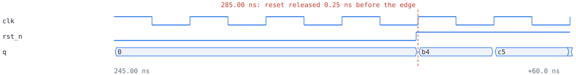

# clockguard: rst_unsync

1 error(s), 0 warning(s), 0 waived. 8 flop bits, 1 domain(s), 0 synchronizer(s).

## Clock domains

| domain | kind | group | flop bits | posedge / negedge | gated by |
|---|---|---|---|---|---|
| clk | primary | 0 | 8 | 8 / 0 | - |

## Resets

| reset | kind | stages | synchronous to | from | consumers |
|---|---|---|---|---|---|
| rst_n | input | - | - | rst_n | clk: 8 |

## Synchronizers

none

## Crossings

none

## Violations

### error: RST_UNSYNC

`rst_n -> q (clk)`

8 flop bit(s) in clk (q...) are reset by input rst_n, which can release at any point of the clk cycle; some flops leave reset an edge before others (recovery/removal). Add a reset synchronizer clocked by clk (assert asynchronously, release through 2 flops)

Path: `rst_n -> q[0]`

Simulation: observed 40 hazard(s); first at 285.00 ns (reset released 0.25 ns before the edge), 24 clk cycles after reset release

